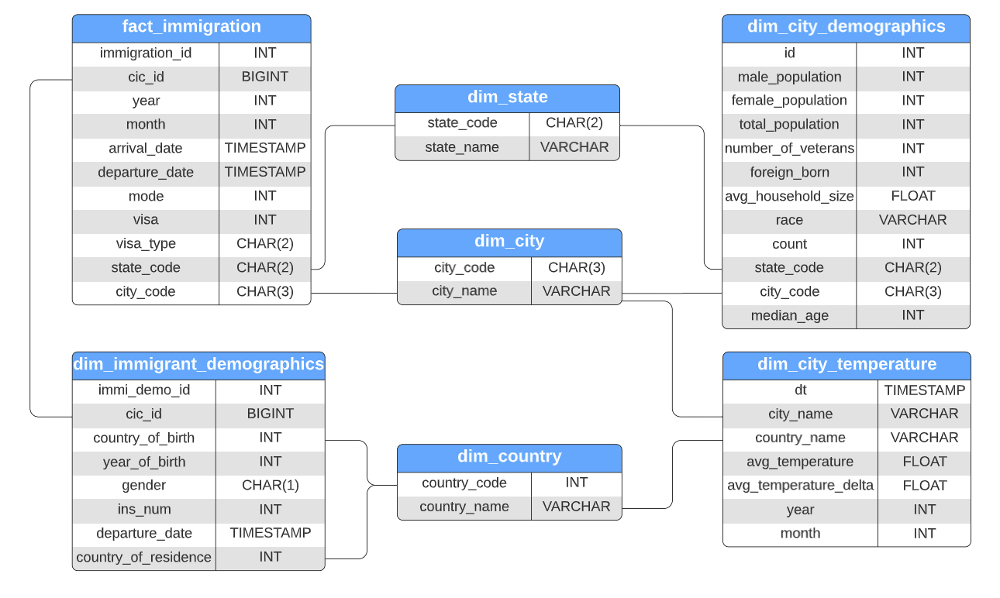

# Immmigration Demographics Single-Source-Of-Truth table

- [About](#about)
- [ETL Pipeline Design](#etl-pipeline-design)
- [Getting Started](#getting-started)
- [Directory Strucure](#directory-structure)
- [Future Work considerations](#future-work-considerations)
- [References](#references)

## About
The goal of this project is to create a single-source-of-truth date warehouse that can serve as the foundation for creating logical data marts for analytics purposes on I94 immigration data, city temperatures data and U.S. demographics data. The raw data resides in S3 and will be processed using Apache Spark into fact and dimension table before written back to S3.     


#### Scope 
In order to create a single-source-of-truth data warehouse, the following steps are executed:

* Load dataset into Spark dataframes
* Exploratory data analysis of I94 immigration dataset to identify missing values, empty records, etc, informing the data preprocessing step downstream
* Exploratory data analysis of U.S. city demographics dataset to identify missing values, empty records, etc, informing the data preprocessing step downstream 
* Exploratory data analysis of world temperatures dataset to identify missing values, empty records, etc, informing the data preprocessing step downstream 
* Execute data proprocessing tasks for all datasets
* Create immigration fact table from preprocessed I94 immigration dataset 
* Create dimension tables:
    * Create immigrant demographics dimension table from preprocessed I94 immigration dataset. Relates to immigration fact table by `cic_id` (unique record id) 
    * Create us city demographics dimension table from U.S. city demographics dataset. Relates to immigration fact table by `state_code`
    * Create world temperature dimension table from preprocessed world temperature dataset. Relates to immigration fact table by composite key `city_name`
    * Create country dimension table from `i94cit_i94res` data in the I94_SAS_Labels_Descriptions.SAS file
    * Create city dimension table from `dim_i94port` data in the I94_SAS_Labels_Descriptions.SAS file
    * Create state dimension table from `dim_i94addr` data in I94_SAS_Labels_Descriptions.SAS file
* Perform data quality checks
* Write created fact and dimension tables to S3
    
##### Datasets:

| Data Set | Format  | Description |
|  :-     |  :-    |  :-        |
|[I94 Immigration Data](https://www.trade.gov/national-travel-and-tourism-office)| SAS | Dataset contains international visitor arrival statistics by world regions, mode of transportation, port of entry, demographics, visa type, etc.|
|[World Temperature Data](https://www.kaggle.com/datasets/berkeleyearth/climate-change-earth-surface-temperature-data)| CSV | Dataset contains monthly average temperatures by city.|
|[U.S. City Demographic Data](https://public.opendatasoft.com/explore/dataset/us-cities-demographics/export/)| CSV | Dataset contains information about the demographics of all US cities and census-designated places with a population greater or equal to 65,000.|

##### Tech Stack:
We've made use of the followng technologies in this project: 
* [AWS S3](https://aws.amazon.com/s3/) for data storage.
* Apache Spark ([PySpark](https://spark.apache.org/docs/latest/api/python/#:~:text=PySpark%20is%20an%20interface%20for,data%20in%20a%20distributed%20environment.)) processing the data and creating fact and dimension tables.

## Data Warehouse Design

### Database Schema

The data model for our single-source-of-truth datawarehouse looks as follows:



## ETL Pipeline 

### Pipeline Design

The data pipeline is as follows:

1.  Load datasets stored in S3 buckets into Spark dataframes:
       - [READ_S3_BUCKET]/immigration_data/18-83510-I94-Data-2016/*.sas7bdat
       - [READ_S3_BUCKET]/I94_SAS_labels_data/I94_SAS_Labels_Descriptions.SAS
       - [READ_S3_BUCKET]/temperature_data/GlobalLandTemperaturesByCity.csv
       - [READ_S3_BUCKET]/us_demographics_data/us-cities-demographics.csv
    

2.  Create helper dimension tables from I94_SAS_Labels_Descriptinons.SAS file
       - Create country dimension table from `i94cit_i94res` data in the I94_SAS_Labels_Descriptions.SAS file
       - Create city dimension table from `dim_i94port` data in the I94_SAS_Labels_Descriptions.SAS file
       - Create state dimension table from `dim_i94addr` data in I94_SAS_Labels_Descriptions.SAS file

3.  Preprocess I94 Immigration data
4.  Create I94 Immigration fact table - `fact_immigration` - from preprocessed I94 Immigration data  
5.  Create I94 Immigration demographics dimension table - `dim_immigrant_demographics` - from preprocessed I94 Immigration data 
6.  Create U.S. City Demographic dimension table - `dim_city_demographics` - from U.S. City Demographic data
7.  Preprocess World Temperature data
8.  Create World Temperature dimension table - `dim_city_temperature` - from preprocessed World Temperature data 
9.  Perform data quality checks
10. Write created fact and dimension tables to S3 

### Pipeline Execution

You can run the ETL pipeline by running the jupyter notebook ```Capstone Project ETL.ipynb``` notebook after you've uploaded the datasets to your S3 buckets of choice. 

Alternatively, you can run ```etl.py``` to run the ETL pipeline from start to finish after you've uploaded the datasets to your S3 buckets of choice. 

## Directory Structure

```
├── src                                     <- Source code for use in this project.
|   ├── notebooks  
|   |   ├── Capstone Project EDA.ipynb      <- Notebook to run the exploratory data anlaysis steps.
|   |   └── Capstone Project ETL.ipynb      <- Notebook to run the etl pipeline from start to finish. 
|   |         
|   └── scripts  
|       ├── etl.py                          <- Script to execute ETL pipeline.
|       ├── create_tables.py                <- Script to create database tables.
|       └── helpers.py                      <- Script with helper functions for data preprocessing and data quality checks
|
|
├── README.md                               <- README for developers using this project.
├── poetry.lock                             <- The poetry.lock file for reproducing the analysis environment.
└── pyproject.toml                          <- The pyproject.toml file for reproducing the analysis environment.
```

## Future Work Considerations
### The rationale for the chosen tools and technologies
* [AWS S3](https://aws.amazon.com/s3/) for data storage.
* Apache Spark ([PySpark](https://spark.apache.org/docs/latest/api/python/#:~:text=PySpark%20is%20an%20interface%20for,data%20in%20a%20distributed%20environment.)) processing the data and creating fact and dimension tables.

### Data update frequency
* The immigration fact, mmigrant demographics dimension table and temperature table should be updated on a monthly schedule as the raw data is aggregated on a monthly time period.
* The US city demographics table can be updated depending on the refresh time period of the raw data, which, given how involved it is to update census data, can be done annually.

### Future work
The data was increased by 100x
* It seems unlikely that a 100x increase in the data size would be efficiently processes by Apache Spark in standalone server mode and a cloud big data plaform for running large-scale distributed processing jobs such as [Amazon EMR](https://aws.amazon.com/emr/) should be considered to scale.

The data populates a dashboard that must be updated on a daily basis by 7am every day.
* [Apache Airflow](https://airflow.apache.org/) can be used for building out an ETL data pipeline that automates the tasks of processing fresh data and updating the dashboard on a daily basis by 7am.   
 
The database needed to be accessed by 100+ people.
* In this scenario we would move our single-source-of-truth database to a cloud dataware house such as [Amazon Redshift](https://aws.amazon.com/redshift/).

## References

This project is part of the [Udacity Data Engineering nanodegree](https://www.udacity.com/course/data-engineer-nanodegree--nd027).

- [Markdown guide](https://www.markdownguide.org/basic-syntax/)
- [Poetry documentation](https://python-poetry.org/docs/)
